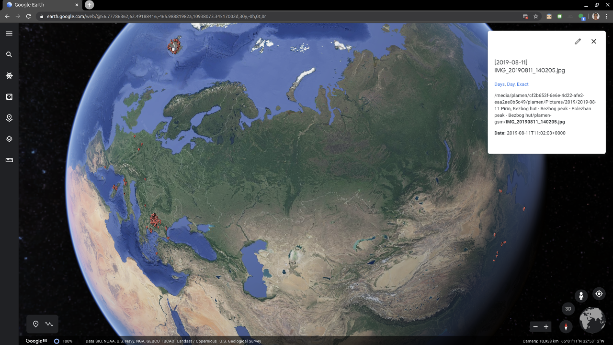
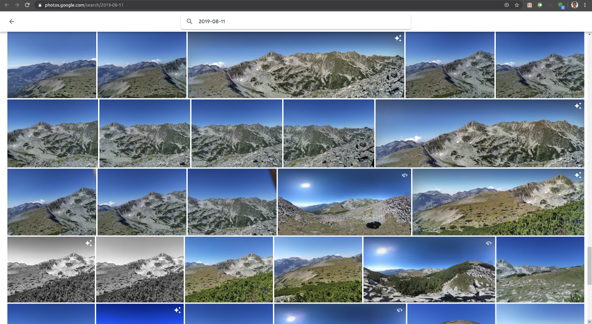
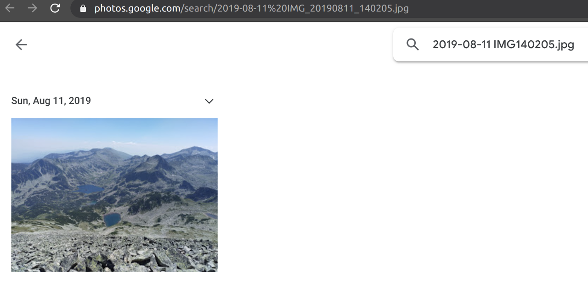
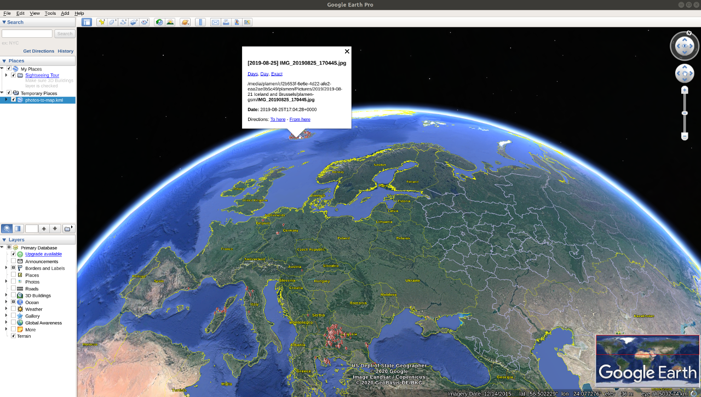
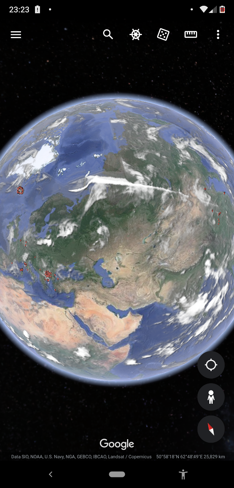
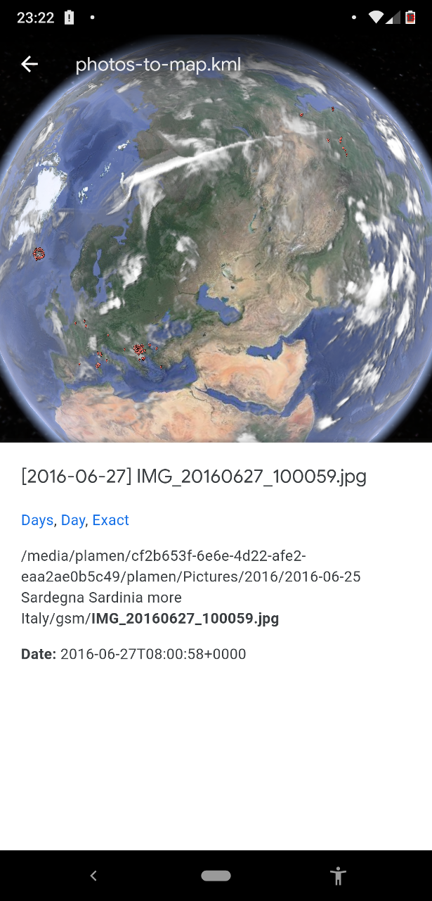
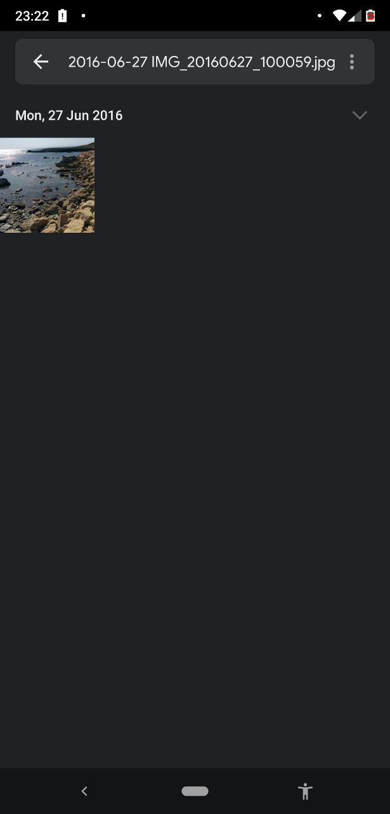

# photos-to-map

This simple script extracts GPS coordinates from all images in a directory. Then it creates KML file with coordinates of all images. There is a link to open the image in Google Photos (if you have a copy of the images in Google Photos) - all photos from previous and next day, all photos from the day of the photo and exact photo are the three options. Then you can always open KML files in any GPS software, e.g. Google Earth ([web](https://earth.google.com/web/)/[desktop](https://www.google.com/earth/versions/#download-pro)/[Android](https://play.google.com/store/apps/details?id=com.google.earth&hl=en)/[iPhone](https://apps.apple.com/us/app/google-earth/id293622097)), [GpsPrune](https://gpsprune.activityworkshop.net/), etc.

There is a docker image here: <https://hub.docker.com/r/ptanov/photos-to-map>. The source code is available here: <https://github.com/ptanov/photos-to-map>.

## Running the script

### Without Docker

- `exiftool` is required (you can install it using `sudo apt install exiftool`)
- `photos-to-map.sh "PATH-TO-IMAGES" > photos-to-map.kml`
- photos in current folder
  - `photos-to-map.sh > photos-to-map.kml`

### With Docker

- `docker` is required (you can install it using [docker install script](https://get.docker.com/))
- `docker run --rm -v "PATH-TO-IMAGES":/data:ro ptanov/photos-to-map > photos-to-map.kml`
- photos in current folder
  - `docker run --rm -v "$(pwd)":/data:ro ptanov/photos-to-map > photos-to-map.kml`

## Screenshots

### [Web](https://earth.google.com/web/)

- 
- 
- 

### [Desktop](https://www.google.com/earth/versions/#download-pro)

- 

### [Android](https://play.google.com/store/apps/details?id=com.google.earth&hl=en)

-   

## What if I don't have GPS coordinates

You can download your Location History (if enabled) from [Google Takeout](https://takeout.google.com/settings/takeout). Select only `Google Location History` and use `KML` format (instead of `JSON`). Then you can create a copy of your photos and run this command targeting the COPY of the images (it will set approximately location to the images) `exiftool -api GeoMaxIntSecs=18000 -api GeoMaxExtSecs=18000 -overwrite_original -geotag "Location History.kml" "PATH-TO-IMAGES/*"`. For more information check [exiftool](https://exiftool.org/ExifTool.html).

## Docker

- It is available in docker hub: https://hub.docker.com/r/ptanov/photos-to-map
- To build run `docker build . -t ptanov/photos-to-map`

## Performance

It tooks ~ 20 minutes to generate KML files for all my images (from 2005 until now - more than 800 folders) on my 10+ years old i7 laptop with HDD (no SSD).
